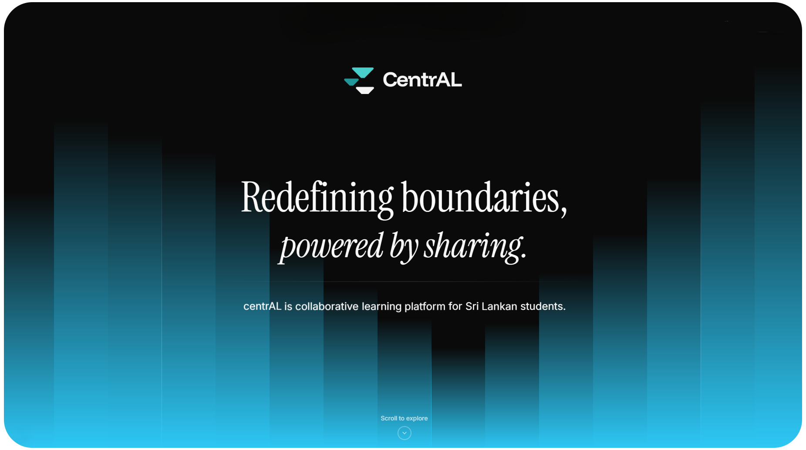

  

<h1 align="center">centrAL Chat</h1>

  

---

## About centrAL Chat

centrAL Chat is an AI-powered conversational learning platform specifically designed for Sri Lankan G.C.E Advanced Level students. Built on the Morphic framework with advanced AI capabilities, it provides intelligent, contextual assistance for academic subjects and learning support.

## Features

- **AI-Powered Chat** - Advanced conversational AI with multiple provider support (OpenAI, Anthropic, Google, Groq, and more)
- **Subject-Focused Learning** - Specialized assistance for A/L subjects with Sri Lankan curriculum context
- **Intelligent Search** - Real-time web search integration for up-to-date information
- **Chat History** - Persistent conversation storage
- **Real-time Streaming** - Fast, streaming AI responses with Vercel AI SDK

## Acknowledgments

- Built on [Morphic](https://github.com/miurla/morphic)
- Powered by [Vercel AI SDK](https://sdk.vercel.ai/)
- UI components by [Radix UI](https://www.radix-ui.com/)
- Styling with [Tailwind CSS](https://tailwindcss.com/)

---

  Made with ❤️ for Sri Lankan students

